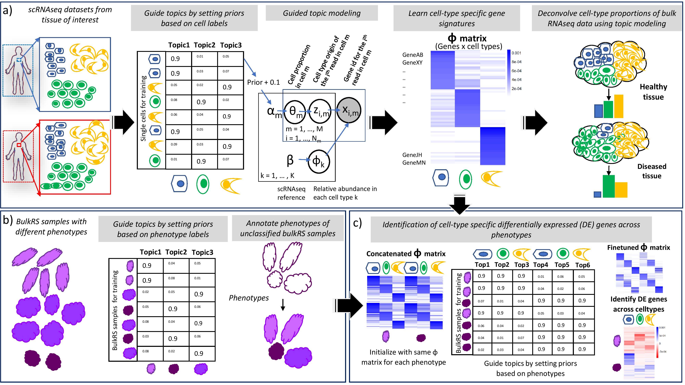

# GTM-decon: Guided Topic Modeling for Deconvolution of cell types from bulk RNA-seq data



**GTM-decon overview:** 
We developed GTM-decon to model cell-type information from scRNA-seq data and subsequently use it to deconvolve bulk RNA-seq data. GTM-decon works by factorizing gene expression data from large single-cell gene expression datasets (cells-by-genes matrices) into two matrices: a genes-by-topics (i.e., cell type) matrix (&Phi;) capturing the importance of gene expression of each gene for each cell type, and a cells-by-topics matrix (&theta;) capturing the importance of different topics (i.e., cell types) in each cell. The modelling is guided by the prior knowledge of cell type labels in the scRNA-seq datasets. Each cell-type is modelled as a topic (or a set of topics). This guides the topic inference (&theta;) to anchor each topic at a specific cell type and subsequently influences the genes-by-topics (&Phi;) inference. The latter as a global parameter is subsequently used to infer the cell-type proportion in a bulk RNA-seq sample, which manifests as averaged gene expression from all cell types in a tissue of interest. Deconvolution of bulk RNA-seq datasets enables their segregation into different constituent cell types, thereby elucidating their cell-type proportions. This in turn can be used as a surrogate to gauge the cognate biological states of the subjects, such as their health status or disease progression.

GTM-decon is a Unix-style command-line tool. You can compile it on a unix machine.

## Installation:

To install GTM-decon, you will need to first install armadillo (http://arma.sourceforge.net)

Assuming you are in the gtm-decon directory, to compile, simply run:
```
make
```

## Pre-processing the data:
The scripts for scRNA-seq and bulk RNA-seq data preprocessing are available in the **pre_processing/** folder.

Mainly, the **prepare_single_cell_input_PBMC.py** file serves as a template to convert the single-cell data into input datasets representing the various gene selection strategies: all genes, pre-processed genes, highly variable genes, and the corresponding transformations - normr, normr_log1p, as well in generating the cell-type mapping for each cell as a one-hot encoded file. The input file is required to have all the gene expression data as a cells X genes matrix, along with a column "Celltype" containing cell type information. The set of genes returned for each of the gene selection strategies can be provided as input gene set to the GTM-decon python wrapper by setting **override_geneset=True** and passing the list of genes to **genes** attribute.
	
## Running GTM-decon using a Python wrapper: 
The folder **PythonWrapper/** contains the code **GTM_decon.py**, which is a python wrapper built around the GTM-decon C code engine for simplifying its usage. It serves as a single script to train a GTM-decon model, infer cell-type proportions in bulk, and evaluate using deconvolution metrics. Please see the README.md file in the folder for more details. The **vignettes/** folder contains tutorials for running and analysing GTM-decon using an example scRNA-seq dataset.

## Using GTM-decon for phenotype-guided training of bulk RNA-seq data:
Most of the steps are essentially similar to that used for cell-type-guided training of scRNA-seq data. The same scripts described above can be used for this purpose. The main difference is in the input bulk RNA-seq data matrix, which is sparsified to make it amenable for working with topic models (see Methods). 
	
## Using GTM-decon as a nested guided topic model to identify cell-type specific differentially expressed genes between phenotypes from bulk RNA-seq data:
Here, the phenotype-labels are used as primary-level, and cell-types as secondary-level. To generate the training data to reflect these guides,
```
./singleCellInput_DE $input_dir/counts_matrix_train.tab $input_dir/cell_labels_oh_train.csv $output_dir/ <number of topics per cell-type> <number of cell-types>
```
The approach also requires pre-trained GTM-decon &Phi; matrices, concatenated X number of phenotypes to serve as the input &Phi; matrix for training. The key is to transform this matrix to contain the same genes present in the bulk RNAseq data for phenotypes, in the same order. 

The input cell-type specific pre-trained &Phi; matrices are fine-tuned to reflect changes in the phenotypes using GTM-decon:
```
./gtm-decon --outputIntermediates -f $scdata -m $scmeta -trp $scprior -k $K -i $niter --inferenceMethod JCVB0 --maxcores 10 --presetTopicsPrefix $preset_path

New flag:
	--presetTopicsPrefix $preset_path (path to the concatenated input &Phi; matrix)
```

## Post-processing scripts:
Scripts for post-processing to achieve two of the most important tasks after trainining and deconvolution are listed in the **post-processing/** folder. 

**a) Visualizing the genes-by-CTS-topics matrix:** To visualize the top-n genes in each, script Fig3a.R can be used. This script reproduces **Fig3a** in the main text. The input data, which is the normalized &Phi; matrix obtained after training, is provided in the data folder. The script inputs this file, along with gene markers in CellMarkerDB and PanglaoDB, and visualizes the top20 genes per topic as a heatmap. Genes also present in the CellMarker DB / PanglaoDB for that specific cell type (marker genes) are also annotated visually.

**b) Visualizing the samples-by-CTS-topics matrix:** This matrix corresponds to the results of deconvolution, showing the deconvolved cell type proportions for each of the bulk samples. Fig 3b.R reproduces **Fig3b** in the main text. The input data, which is the normalized metagene file obtained after inference, is provided in the data folder. The script inputs this file, along with phenotype information for the samples, and visualizes the clustered heatmap in terms of their cell-type proportions. Annotating the samples according to their phenotypes also enables us to visualize the effect of cell type proportions on phenotype identification.
The expected output files are also provided in the data/ folder for comparison.

Scripts to regenerate the figures in **Fig3**, **Fig4**, **Fig5**, and **Fig6** are also available in the **post-processing/** folder, with the corresponding input and output files in the **data/** folder.
