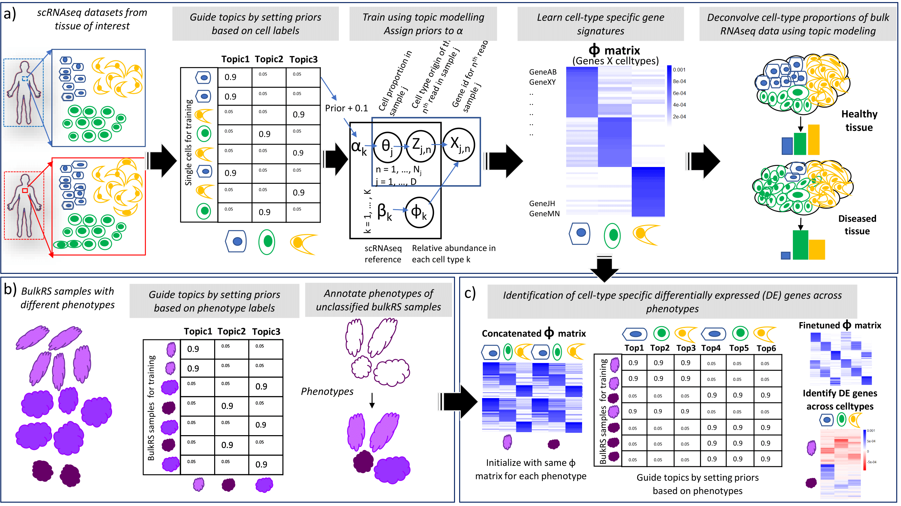

# GTM-decon: Guided Topic Modeling for Deconvolution of cell types from bulk RNA-seq data



**GTM-decon model overview:** GTM-decon uses a guided topic modeling approach to model cell-type information from single cell RNAseq data and subsequently use it to deconvolve cell-type proportions from bulk RNAseqRNA-seq data. GTM-decon works by factorizing the gene expression data from the large single cell gene expression datasets (cells-by-genes matrices) into two matrices: a genes-by-topics (i.e., cell types) matrix (φ) capturing the importance of gene expression of each gene for each cell type, and a cells-by-topics matrix (θ) capturing the importance of different topics (i.e., cell types) in each cell. The modelling is guided by the prior knowledge of cell type labels in the single cell datasets. Each cell-type is modelled as a topic (or a set of topics), by enforcing topic to cell type assignment by means of the Bayesian topic prior values assigned to the α hyperparameter, which are set to high values in comparison with the rest of the topics for topic(s) corresponding to that cell type (see Methods). This forces the topic inference (θ) to anchor each topic at a cell type and subsequentaly influences the genes-by-topics (ϕ ) inference. The latter as a global parameter is subsequently used to infer the cell-type proportion in a bulk RNA-seq sample, which manifests as averaged gene expression from all cell types in a tissue of interest. Deconvolution of bulk RNA-seq datasets enables their segregation into different constituent cell types, along with the elucidation of cell-type proportions. This in turn can be used as a surrogate to gauge the biological aspects of the sample from which the bulk RNA-seq data was obtained, such as its health (healthy vs. diseased) as well as developmental-state or cell-state.

GTM-decon is a Unix-style command-line tool. You can compile it on a unix machine.

## INSTALLATION:

To install GTM-decon, you will need to first install armadillo (http://arma.sourceforge.net)

Assuming you are in the gtm-decon directory, to compile, simply run:
```
make
```

## Input data:
See toy_dataset.tar.gz for format of training data (vased on pancreatic scRNA-seq data)

To run GTM-decon, the following files are required:

a. metaData.txt file - Stores information about the phenotypes ie. genes in our case in the format <typeID, pheID, stateCnt> where typeID indicates a distinct phenotype (in this cases genes - designated 1, pheID corresponds to phenotypeID for each gene, ie. gene1, gene2, ... geneN), and stateCnt indicates number of states for phenotype - corresponds to only one state in this case 
b. trainData.txt file - Stores information about the counts data in the format <cellID, typeID, pheID, stateID, freq> where typeID and pheID correspond to metaData file above, cellID corresponds to the cell IDs, as in 1, 2, 3... M, stateID is 0 based in this case, freq corresponds to value of counts. This information is provided only for those cells and genes where the count is non-zero
c. priorData.txt file - Stores information about prior probabilites for each cell type for each cell ID in the format <cellID, topicId, priorprob> where topicID corresponds to the metaphenotype ID (corresponding to 'N' topics for 'N' cell types in most of the general cases), starting from an index of 0, and the prior probability for the cell type for that cellID (must be >0 and <=1). GTM works by using the one-hot cell type encodings for the cellIDs to assign prior probabilites. The topic corresponding to the cell type is assigned a prior probability of 0.9, and the rest of the cell types are assigned a value corresponding to 0.1/(number of cell types - 1).

These can be generated from single cell RNA-seq (scRNA-seq) count matrices using the following scripts:

Required information from scRNA-seq count matrices:
    Count matrix (as cell types x genes),
    Meta data corresponding to "Celltype" for each cellID, and "Batch" information corresponding to the individual / sample from which the cellID was obtained
```
python3 prepare_single_cell_input_PI_Segerstolpe.py --path_input <path to input file containing scRNAseq data in cells x genes format> --path_save <path to output directory where all the various preprocessing and one-hot encoded cell label files are to be saved>
```
Next, we split scRNAseq data into training, validation and test datasets for training and evaluation purposes in the ratio 70:10:20
```
python3 train_test_validation_split.py --path_input <path to directory containing all preprocessed input files> --path_save <path to output directory where all the split files are to be saved>
```
The validation data / test data / simulated bulk data / real bulk data are all stored in the same format as training data. No prior information is available / provided for these.

From these files, the input files for GTM-decon are generated using these C++ scripts:
For training data:
```
./singleCellInput <path_to_input_files/counts_matrix_pp_train.tab> <path_to_input_files/cell_labels_oh_train.csv> <path_to_output_files/trainData.txt> <path_to_output_files/priorData.txt> <path_to_output_files/meta.txt> <path_to_output_files/genes.txt>
``` 
The genes.txt file contains the names of the genes used in training, which is useful later on to generate bulk RNAseq data based on the same set of genes.

For validation / test data:
```
./singleCellInput_TestData <path_to_input_files/counts_matrix_pp_test.tab> <path_to_output_files/testData.txt>
```

## Training GTM-decon using scRNA-seq data:
```
./gtm-decon -f $scdata -m $scmeta -trp $scprior -k $K -i $niter --inferenceMethod JCVB0 --maxcores 8 --outputIntermediates

Flags are:
	-f: single cell training data file
	-m: meta file
	-trp: prior file
	-i: number of iterations
	-k: number of topics (for 2-topic model, k = 2 x number of cell types, for 3-topic model, k = 3 x number of cell types etc.)
	-n: inference method (JCVB0)
	--maxcores: maximum number of CPU cores to use
	--outputIntermediates: (whether output intermediate learned parameters for inspection)
```	

## Deconvolution of cell-type proportions in bulk RNA-seq data using trained GTM-decon:
	The key is to ensure that bulk RNAseq data oonsists of the same genes used in the training data, in the same gene order. The following scripts can be used to transform bulk RNA-seq data accordingly:
	```
python3 prepare_bulkRNAseq_input.py --path_input <bulk RNAseq counts input file> --path_save <path to save output files in> --preprocessed_genes <path containing genes used in training set>
./bulkRNAseqInput <path to bulkRNAseq input file> <path to bulkRNAseq output file>
	```
        ./gtm-decon -m $scmeta -n JCVB0 --newRSSamplesData $bulkdata -k $K -i $niter --inferenceMethod JCVB0 --maxcores 8 --outputIntermediates \
	            --trainedModelPrefix <path to trained gtm-decon files>/trainData_JCVB0_nmar_K$k_iter$niter
	```


The main command is: (Note: This uses the normal MixEHR engine, without guided topic modelling)

        <Path to MixEHR - Original>/mixehr -m $scmeta -n JCVB0 --newPatsData $bulkRSdata \
                                --trainedModelPrefix $path/trainData_JCVB0_nmar_K14_iter$file -k $K --inferNewPatientMetaphe \

4. Prediction of cell-type associated with a cell and Deconvolution of cell-type mixtures along with estimation of cell-type proportions for bulk RNAseq data

	The inferred cell type topic mixtures can be used for 2 purposes:

	a. Predict the likely cell-type corresponding to the cell, for cells with unknown associations in single cell datasets

		The cell type corresponding to the topic with the highest probability after inference is predicted to be the likely cell type. To evaluate the accuracy of the model, the percentage of matched indices for each of the cells, in terms of their one-hot encoding and inference matrices, is calculated as the accuracy, wherever cell types are available for validation / test datasets

		./Accuracy <path to inferred meta phenotype file - ie. *_metaphe.csv> <path to corresponding one-hot encoding file of the cell labels> Note: Ensure that there are same number of columns in both, in the same order

	b. Deconvolve the cell types in bulk RNAseq datasets and estimate their proportions, in order to correlate them with biologically / clinically relevant parameters to generate hypotheses.
		
		The inferred topic mixture proportions are predicted to be the cell-type proportions in the bulk RNAseq data, as each topic corresponds to a cell-type. For cases where the cell-type proportions are known (ie. for simulated / artifical datasets), the similarity between the actual cell-type proportions and inferred topic mixture proportions are calculated using 3 metrics: pearson correlation coefficient (PCC) , root mean square deviation (RMSD), and mean absolute deviation (MAD).
		
		./Deconvolution_metrics <path to known cell type proportions file>  <path to inferred meta phenotype file - ie. *_metaphe.csv> Note: Ensure that the
re are same number of columns in both, in the same order

5. Visualization

	To summarize the key learnings from each of the iterations during training phase, the following plots are useful and can be generated as follows:

	a. Plot of log-likelihood over all the iterations, to evaluate its lowest point and the iteration after which it stabilises
		python3 visualize_MixSC.py --mode loglik --loglik <log_likelihood file for the last iteration ie. _logTrainLik.txt> --path_save <path to save output file as a .png>

	b. Plot of median pearson correlation coefficients (PCC) over all the iterations, to identify the iteration with the highest median PCC, which is subsequently used as the training model for inferring topic mixtures
		python3 visualize_MixSC.py --mode pcc --pcc <file containing all median PCCs for all iterations> --path_save <path to save output file as a .png>

	c. Visualisation of the cell by gene matrix (the beta matrix) in terms of the top 10 genes - from the <phi_normalized.csv> file
		python3 visualize_MixSC.py --mode beta --beta <phi_normalized.csv file for iteration of interest> --genes <genes.txt> --path_save <path to save output file as a .png>

	d. Visualisation of the cell by cell-type mixture matrix (the theta matrix) - from the <metaphe.csv> file
		 python3 visualize_MixSC.py --mode theta --theta <metaphe.csv file for interation of interest along with cell type information> --path_save <path to save output file as a .png>

6. Other training files

	Apart from training only using main cell types, where each topic is mapped to a cell type, and all samples / batch information is used, the following variants can be used:

	a. Training for sub-types of main cell types, wherever sub-type information is available.

		The following scripts can be used as a template:

		python3 prepare_single_cell_input_HB_subtypes.py - to generate count matrices and corresponding  one-hot encoding of cell types for all the main cell types
		python3 prepare_single_cell_input_HB_subtypes_pp.py --input <counts_matrix_subtype.tab> --path_save <directory in which to save preprocessing output files> - to prepare the counts matrices for all pre-processing options
		python3 train_test_validation_split_subtypes.py - to generate train / test / validation datasets for all the main cell types

	b. Training each cell type using 2 topics - one using healthy patients, one using diseased patients.

		The following scripts can be used as a template:

		python3 prepare_single_cell_input_PI_Segerstolpe_2topic_healthy_diseased.py - assigns 2 topics for cell types based on whether training data comes from healthy or diseased individuals - and generates one-hot encoding of cell labels (double the number of cell types)
		python3 train_test_validation_split_2topic_2topic_healthy_diseased.py - generate train / test / validation datasets based on the 2topics per celltype set

	c. Training using 3topics for each cell type - where 3 consecutive topics are assigned to each cell type, and the prior probabilities are set to 0.3 for each of the topics when it corresponds to the cell type (summing to 0.9 for the cell type), and the rest of the probabilities add up to 0.1.

		The following scripts can be used as a template:

		./singleCellInput_3topics <path_to_input_files/counts_matrix_pp_train.tab> <path_to_input_files/cell_labels_oh_train.csv> <path_to_output_files/trainData.txt> <path_to_output_files/priorData.txt> <path_to_output_files/meta.txt> <path_to_output_files/genes.txt> - for generating training data
		./Accuracy_3topics <path to inferred meta phenotype file - ie. *_metaphe.csv> <path to corresponding one-hot encoding file of the cell labels> - for calculating accuracy by combining the values of 3 consecutive topics (representing a cell type)
		./Metaphe_3topics <path to inferred meta phenotype file - ie. *_metaphe.csv> <path to corresponding one-hot encoding file of the cell labels> - for generating a metaphe.csv file corresponding to 1 topic per celltype from the 3 topics to celltype case by combining the values of 3 consecutive topics (representing a cell type) - for visualisation, and deconvolution purposes

		** Deconvollution **

	d. Training using 

		
		
	
			

		
7. Simulation of bulk RNAseq data from scRNAseq data

